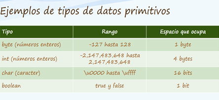
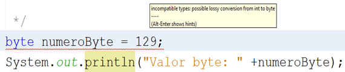
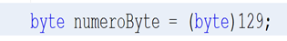

# Tipos de datos

# ¿Cuáles son los tipos de java?

* Tipos de datos primitivos
* Tipos de datos referenciados

# ¿Cómo son considerados los tipos referenciados?

Se consideran **como extensiones de la clase Object(clase padre de todas las clases) también conocidos como referencia a objetos.**

# ¿Cómo se clasifican los tipos referenciados?

* Clases
* Interfaces
* Arreglos(arrays)

# ¿Cómo se clasifican los tipos primitivos?

* Entero
* Flotantes

# ¿Cuáles son las ventajas de los tipos primitivos?

Mayor rapidez y ahorro de recursos.

# ¿Cuál es el objetivo de los tipos primitivos?

Que los algoritmos sean más eficientes.

# ¿Qué valor tiene los tipos primitivos?

Un valor por default

# ¿Por qué es importante conocer el valor por default?

Porque  cuando utilizamos los tipos primitivos en conjunto con las clases, el compilador tomara en cuenta este valor por default según el tipo de dato que utilicemos.

# ¿Dónde aplica el valor por default?

Cuando los tipos primitivos son usados como atributos de la clase.

# ¿Cómo se clasifican los tipos enteros?

        Byte – 8 bits – Default: 0  
        Short – 16 bits – Default: 0
        Char – 16 bits – Default: \u0000
        Int – 32 bits – Default: 0
        Long – 64 bits  Default: 0

# ¿Cómo se clasifican los tipos flotantes?

        Float – 32 bits – Default : 0.0
        Double – 64 bits – Default: 0.0

# ¿Qué tipo de dato primitivo puede almacenar solo el valor de true o false?

Boolean

# ¿Cuál es el valor por default del boolean?
False

# ¿Cuáles son los algunos ejemplos de los tipos primitivos?

Nota: el rango en char en esta tabla es de Unicode. La pág. Web de Unicode es [unicode-table.com/es](https://unicode-table.com/es/) 

# Ejemplo de un tipo primitivo

Marca un error **debido a que se pasó del rango que puede aceptar un tipo byte.** El error indica que si convertimos  un int a un byte  podemos **tener una pérdida de precisión al hacer la conversión de int hacia byte debido a que el valor entero ya supero  el valor máximo que puede almacenar un byte ya que el valor máximo de un byte es 127 y el mínimo es -128.**

Con esta conversión obligamos al compilador a convertir el valor numérico de 129 de tipo entero a un tipo byte.
Resultado de realizar la conversión del valor entero a byte:

        Valor byte: -127

Nota: 

Al hacer una conversión fuera del rango mínimo y máximo del tipo de dato como por ejemplo short  que tiene 32767 se pierden bytes es decir que cada valor decimal se puede convertir a valor binarios (ceros y unos), la perdida es eliminar esos ceros y unos de un número y por tanto volver a convertir ese número binario a decimal no genera el mismo número (valor). 
